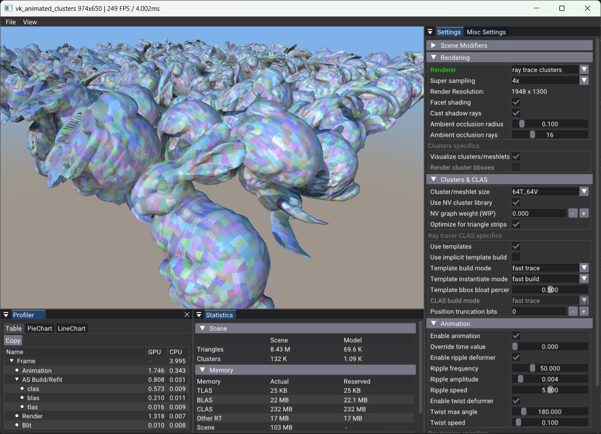

# vk_animated_clusters

This sample demonstrates the usage of the `VK_NV_cluster_acceleration_structure` extension for ray tracing geometry built from **clusters**. The extension is part of the **_NVIDIA RTX Mega Geometry_** feature set.


**Clusters - Cluster Acceleration Structures (CLAS)**:
- Contain a group of triangles with a fixed upper limit (e.g 128 triangles, 128 vertices), like meshlets in mesh-shading. The triangles do not have to be connected, though ideally for improved vertex reuse they should. Furthermore, for best performance the triangles should be spatially grouped in such ways that the axis-aligned bounding boxes of clusters minimize overlap among each other.
- CLAS can be referenced when building a bottom level acceleration structure (BLAS). They are not copied in like in a traditional triangle BLAS, which allows more memory control and re-use across BLAS in cluster-based level of detail schemes. They **do not** support additional transforms.
- CLAS can be built, but cannot be updated. There is, however, an optimized way to create them through **cluster templates**.

When the animation is active, the sample also highlights the benefits of **cluster templates** to improve performance of updating ray tracing geometry.

**Cluster templates**:
- Store the topological information of a cluster, and can be built once, then re-used.
- Are used to **instantiate clusters** by combining a cluster template with vertex data. This is a key feature to faster animation updates as it speeds up CLAS creation time.
- Can benefit from providing reference vertices and or bounding box information. They will not store these vertices, and instantiated vertices remain compatible as long as they fit in the bounding box, if one was provided.


CLAS were designed foremost to speed up BLAS builds in a GPU-driven pipeline. They do not fully replace traditional triangle list based BLAS, especially for static content, as the triangle BLAS can provide better ray intersection performance. You can observe this in this sample as well: using clusters may render slower with higher numbers of ambient occlusion samples. This may offset the benefits of the faster builds, although, in the general use-case for real-time ray tracing it should be fine and the sample's simple shading stresses intersection performance.

> Note: We recommend the use of CLAS when the triangle mesh is changing frequently, for example:
> - fine grained level-of-detail schemes to handle streaming out of core content
> - animation updates through skinning or other deformation
> - adaptive tessellation. 
> In these scenarios it should supercede triangle BLAS refits. However, for purely static data, the traditional triangle BLAS is still recommended.

More about the extension details later.

## Sample Usage



When no custom glTF 2.0 file is loaded (via commandline or _"File>Open"_), the default scene is created using many instances of the Stanford bunny model. Each instance has a unique set of vertices that are deformed procedurally to create the animation.

* Change between ray tracing renderers
  * `ray trace triangles`: ray tracing using classical input of triangles within a bottom-level acceleration structure per instance, and a top-level acceleration structure
  * `ray trace clusters`: ray tracing of the clustered geometry using the `VK_NV_cluster_acceleration_structure` extension. The clusters are color-coded for illustration purposes (can be disabled via _"Visualize clusters/meshlets"_).
  * ray tracing modes use a crude shadow and ambient occlusion shading, whose parameters can be controlled using the ambient occlusion radius and samples parameters.
  * rasterization modes only allow a basic screen-space ambient occlusion effect.
* Increase scene complexity by instancing the entire scene on a grid via _"Scene Modifiers > Number of scene copies"_
  * Each instance gets its own set of vertex / normal buffers
  * The _"layout grid axis bits"_ parameter controls the 3D layout of the copies. 
* Enable or disable the animation with _"Animation"_ section
  * Enabling animates the individual vertex and normal buffers for each instance using a compute shaders.
  * You can change the two different effects. Twisting is used to mimic larger deformations, like in skeletal animation, whilst ripple is used for smaller changes. You can also influence how often the traditional ray tracer would do rebuilds rather than just refits. On high twist angles you will see a higher render time loss if only doing refits. 
  * The _"Ray tracer specifics"_ settings allow to change the BLAS and TLAS build flags. Note that the sample was mostly meant to showcase faster builds for animated content, therefore no compaction is performed and `VK_BUILD_ACCELERATION_STRUCTURE_ALLOW_UPDATE_BIT_KHR` is always set for traditional triangle BLAS.
* Play with the _"Clusters & CLAS"_ properties
  * _"Cluster/meshlet size"_: We found that 64 triangles 64 vertices works quite well. Larger clusters save more memory and speed up animation updates, but they can negatively impact render time (and espcially mesh-shaders would be sensitive to them). We use a new open-source library for clusterization [nv_cluster_builder](https://github.com/nvpro-samples/nv_cluster_builder) as well as [meshoptimizer](https://github.com/zeux/meshoptimizer) for optimizations.
  * _"Use templates"_: If set we build one set of cluster templates for the original model once, and then use it to instantiate the clusters for each animated instance quicker. Otherwise the CLAS are built directly from index and vertex data.  
  * _"Template / CLAS build / instantiate mode"_: These flags influence creation time of templates or CLAS, the ray tracing time of CLAS, as well as the overall memory consumption.
  * _"Template bbox bloat percentage"_: While templates do not store positions, position and bounding box information can help decrease memory and speed instantiation up a bit. This factor adds a percentage of the object's bounding box to the individual bounding box of a cluster, to account for later animation changes. Setting it too low will result in artifacts.
  * _"Position truncation bits"_: To further improve memory usage of clusters, developers can provide how much bits in the provided fp32 positions are to be dropped. This is a relatively easy way to reduce the memory usage of the clusters and highly recommended, especially **cluster templates** are very sensitive to this. Reducing the memory footprint speeds up instantiation time and can also improve trace performance (less bandwidth needs).

For development and debugging purposes the sample also contains two rasterization renderers: 
* `raster triangles`: Rasterization using classical vertex and fragment shading.
* `raster clusters`: Rasterization of the clustered geometry using a mesh shader. The clusters are color-coded for illustration purposes, and the bounding boxes of the clusters can be displayed.

Profiling information for rendering, animation and acceleration structure updates can be found in the _"View"_ menu and choosing _"Profiler"_, it should be visible by default at the bottom.

### Preliminary Performance Results

The tested scene is the default scenario, made of 8.43 million fully animated triangles.
With the animation active, but using a frozen time value, we compared a few **Ray Tracing** scenarios on
a `NVIDIA RTX 6000 Ada Generation` rendering at a resolution of `2560 x 1440`. 

The BLAS was set to `Fast Build`. Cluster templates were set to `Fast Trace` and instantiation to `Fast Build`.

| Timer [ms]     | Triangles (10% rebuilds) | Triangles (only refits) | Clusters w. Templates |
|----------------|--------------------------|-------------------------|-----------------------|
| AS build/refit | 5.22                     | 2.78                    | 0.80                  |
| Render         | 1.39                     | 1.45                    | 1.52                  |
| Sum            | 6.61                     | 4.23                    | 2.32                  |

We can see that the build times improve significantly with the new APIs, despite their very early state in the life of cluster ray tracing.
As the BLAS is built over clusters and not individual triangles, a degradation in actual rendering performance is expected. 
That is why we want to stress, that if you have static content, `FAST_TRACE` triangle BLAS are still the best option.

However, we recommend to test your own content and implementation, as performance always depends on the actual scenarios.
As driver and hardware performance improves over time we will update this table.

One extra benefit of using clusters with templates is that we can query a quite accurate number for the
instantiated CLAS size, this allows us to reduce the amount of the required reserved memory by a lot.

| Memory Reservations [MB]     | Triangles | Clusters w. Templates |
|------------------------------|-----------|-----------------------|
| BLAS                         | 564       |  22                   |
| CLAS                         | -         | 232                   |
| Other RT (mostly templates)  | -         |  17                   |
| Sum                          | 564       | 271                   |

## VK_NV_cluster_acceleration_structure

The API details are found within [vk_nv_cluster_acc.h](src/vk_nv_cluster_acc.h)

### Principle

The cluster API provides the ability to separate bottom-level acceleration structures (BLAS) into triangle clusters which can be independently built and updated. The topology of a cluster is defined either by explicit indices or by instantiating a "template" encoding a known topology. A BLAS is then built by referencing and reusing those clusters. 

### Cluster-Level Acceleration Structure (CLAS)

A CLAS is similar in principle to a BLAS in which the maximum number of triangles and vertices would be fixed. The CLAS are *referenced* by the BLAS, hence a single CLAS can be referenced by multiple BLAS. Changes to a CLAS require rebuilding the BLAS. Even though it is not possible to refit the BLAS, the rebuild is very fast as it only operates on the bounding boxes of the clusters. For shading, each CLAS can be provided with a `ClusterID`. 

The topology of the cluster, ie. its triangle definition, is either provided using a set of indices like a regular index buffer, or by instantiating a known pattern, or "template". While the former is the most intuitive, it requires storing indices for each triangle of each cluster, which results in significant memory consumption with large scenes. If many clusters have the same topology, as can typically happen when triangulating subdivision surfaces, it is useful to define that topology once and reuse it many times. This is the purpose of template clusters, where the CLAS builder is provided with the address of the template and instructions to instantiate it. 


#### Indirect Cluster Build Operations

The building of cluster-related objects is purely "indirect".

``` cpp
typedef struct VkClusterAccelerationStructureCommandsInfoNV
{
  VkStructureType                                        sType;
  void*                                                  pNext;
  // input descriptor defines details, mostly maxima about the type of operation
  VkClusterAccelerationStructureInputInfoNV              input;
  // implicit destination base address (device sub-allocates from here)
  VkDeviceAddress                                        dstImplicitData;
  // scratch space
  VkDeviceAddress                                        scratchData;
  // destination array for the vk device addresses of the objects
  // in explicit mode it's also the input (more later)
  VkStridedDeviceAddressRegionKHR                        dstAddressesArray;
  // byte sizes of the objects
  VkStridedDeviceAddressRegionKHR                        dstSizesArray;
  // device-side indirect arguments for the operation
  VkStridedDeviceAddressRegionKHR                        srcInfosArray;
  // optional device side count of operations
  VkDeviceAddress                                        srcInfosCount;
  // the device addresses within this struct may be used directly, or through an indirection 
  // to load the actual address from the here provided address.
  VkClusterAccelerationStructureAddressResolutionFlagsNV addressResolutionFlags;
} VkClusterAccelerationStructureCommandsInfoNV;

VKAPI_ATTR void VKAPI_CALL vkCmdBuildClusterAccelerationStructureIndirectNV(
    VkCommandBuffer commandBuffer,
    VkClusterAccelerationStructureCommandsInfoNV const* pCommandInfos);
```

The operations related to CLAS builds are specified using `VkClusterAccelerationStructureInputInfoNV::opType`. These operations work directly on device-side addresses, including their launch parameters (multi-indirect calls):

| `VkClusterAccelerationStructureOpTypeNV`   | operation description                                                    | device-side `srcInfosArray` |
|---------------------------------------------|-------------------------------------------------------------------------|-----------------|
|`..._MOVE_OBJECTS_NV`                       | Move/Copy a set of cluster-related objects                               | `VkClusterAccelerationStructureMoveObjectsInfoNV`|
|`..._BUILD_CLUSTERS_BOTTOM_LEVEL_NV`        | Build a BLAS from references to clusters                                 | `VkClusterAccelerationStructureBuildClustersBottomLevelInfoNV`|
|`..._BUILD_TRIANGLE_CLUSTER_NV`             | Build a CLAS from triangle and vertex information                        | `VkClusterAccelerationStructureBuildTriangleClusterInfoNV`|
|`..._BUILD_TRIANGLE_CLUSTER_TEMPLATE_NV`    | Build a CLAS template from triangle and optional vertex information      | `VkClusterAccelerationStructureBuildTriangleClusterTemplateInfoNV` |
|`..._INSTANTIATE_TRIANGLE_CLUSTER_NV`       | Instantiate a CLAS from a template by combining it with vertex positions | `VkClusterAccelerationStructureInstantiateClusterInfoNV` |

The device-side builds can be used with three modes:

| `VkClusterAccelerationStructureOpModeNV` | mode description                                                    | required input | written (optional) |
|------------------------------------------|---------------------------------------------------------------------|------|-------|
|`..._IMPLICIT_DESTINATIONS_NV`            | Implementation sub-allocates destinations from `dstImplicitData`. Written sizes are precise. | srcInfosArray, dstImplicitData | dstAddressesArray, (dstSizesArray) |
|`..._EXPLICIT_DESTINATIONS_NV`            | Developer provides destination addresses. Written sizes are precise. | srcInfosArray, dstAddressesArray | (dstSizesArray) |
|`..._COMPUTE_SIZES_NV`                    | "Dry run" that only computes the sizes. Written sizes are safe upper bound and tighter than CPU memory estimate. | srcInfosArray | dstSizesArray |

Especially for `IMPLICIT_DESTINATIONS` the device memory needs to be allocated prior to building the CLAS and therefore the CPU-side function `vkGetClusterAccelerationStructureBuildSizesNV` provides conservative bounds on CLAS memory usage and returns the required output and scratch memory size:

| `VkClusterAccelerationStructureOpModeNV` | `vkGetClusterAccelerationStructureBuildSizesNV` returns |
|------------------------------------------|---------------------------------------------------------|
|`..._IMPLICIT_DESTINATIONS_NV`            | Returns single output buffer size for **all elements** together (meant to be used for `dstImplicitData`) and scratch size for all elements |
|`..._EXPLICIT_DESTINATIONS_NV`            | Returns the size of **one element** alone, however scratch size is still for all (`maxAccelerationStructureCount` many) elements |
|`..._COMPUTE_SIZES_NV`                    | Only returns scratch size for all elements |

For these size calculations as well as device-side optimizations during build, each operation type also requires some host side information:

| `VkClusterAccelerationStructureOpTypeNV` | host-side inputs within `VkClusterAccelerationStructureOpInputNV` |
|------------------------------------------|-------------------------------------------------------------------|
|`..._MOVE_OBJECTS_NV`                     | `VKClusterAccelerationStructureMoveObjectsInputNV`                |
|`..._BUILD_CLUSTERS_BOTTOM_LEVEL_NV`      | `VkClusterAccelerationStructureClustersBottomLevelInputNV`        |
|`..._BUILD_TRIANGLE_CLUSTER_NV`           | `VkClusterAccelerationStructureTriangleClusterInputNV`            |
|`..._BUILD_TRIANGLE_CLUSTER_TEMPLATE_NV`  | `VkClusterAccelerationStructureTriangleClusterInputNV`            |
|`..._INSTANTIATE_TRIANGLE_CLUSTER_NV`     | `VkClusterAccelerationStructureTriangleClusterInputNV`            |

Following pseudo code illustrates this process a bit:

``` cpp
// simplified pseudo code
// details like stride and some optional behavior, e.g. address resolution, were omitted

void buildClusterAccelerationStructure(VkClusterAccelerationStructureCommandsInfoNV info)
{
    uint32_t count = info.srcInfosCount ? 
                        loadFromAddress_u32(info.srcInfosCount) : info.input.maxAccelerationStructureCount;
    for (uint i = 0; i < count; i++)
    {
    switch(info.input.opMode):
    case IMPLICIT_DESTINATIONS:
        // The size estimate here may be more conservative than the 'COMPUTE_SIZES' variant for performance
        uint32_t estimatedSize    = estimateImplicitOperationSize(info.srcInfosArray[i], info.scratchData);
        uint64_t dstAddress       = suballocate(estimatedSize, info.scratchData, info.dstImplicitData);
        // Note the returned size is precise and can be less than what was estimated.
        // A result of the fast suballocation can be memory fragmentation which can be mitigated by a subsequent `MOVE_OBJECTS` operation
        info.dstSizesArray[i]     = doOperation(info.srcInfosArray[i], info.scratchData, dstAddress);
        info.dstAddressesArray[i] = dstAddress;
        break;
    case EXPLICIT_DESTINATIONS:
        // The developer is responsible to provide enough space in the destination, there is no safety check
        info.dstSizesArray[i] = doOperation(info.srcInfosArray[i], info.scratchData, info.dstAddressesArray[i]);
        break;
    case COMPUTE_SIZES:
        // The implementation is expected to provide a lower bound than host-side estimates here, 
        // but may still not return a precise result in favor of performance and scratch memory requirements.
        info.dstSizesArray[i] = estimateOperationSize(info.srcInfosArray[i], info.scratchData);
        break;
    }
}
```

#### Sample Code

All relevant code is within [renderer_raytrace_clusters.cpp](src/renderer_raytrace_clusters.cpp).

For simplicity this sample does several operations on the CPU, like preparing the input buffers, reading back the sizes, calculating destination offsets etc. In a fully GPU-driven environment these operations would be done on the device using compute shaders, and use the extension in its full potential. There are other samples that do showcase such a GPU-driven usage.

**Clusters** are built with either `IMPLICIT_DESTINATIONS` or `EXPLICIT_DESTINATIONS`, both using a worst-case estimate, as we don't know their compressed size in advance, and want to avoid an extra `COMPUTE_SIZES` pass during animation. See `RendererRayTraceClusters::initRayTracingClusters`. The `EXPLICIT_DESTINATIONS` code path is chosen when we risk exceeding the 4GB limitations of the implicit destination allocation/buffer. 

**Templates** can be built with either `IMPLICIT_DESTINATIONS` or `EXPLICIT_DESTINATIONS` (configured in the UI). We build one set of templates that are re-used across frames and across instances. See `RendererRayTraceClusters::initRayTracingTemplates`. The templates are built once per geometry, not per render instance.

- The implicit template option uses a slightly larger implicit buffer and a single `IMPLICIT_DESTINATIONS` pass, then compacts the generated templates through the `MOVE_OBJECTS` operation.
- The explicit template option uses a `COMPUTE_SIZES` pass to allocate the final template buffer tightly and compute destination addresses manually. After that a follow up `EXPLICIT_DESTINATIONS` is triggered directly writing into the final destinations.

`RendererRayTraceClusters::initRayTracingTemplateInstantiations` performs the setup for the usage of the templates during instantiations, which end up generating the renderable CLAS. This involves computing the destination buffer for the CLAS as well as pre-configuring the destination arrays, based on the worst-case instantiation sizes that can be queried from the templates.

The actual **cluster build or template instantiation** is done in `RendererRayTraceClusters::updateRayTracingClusters`.

The BLAS for the CLAS clusters is setup using `IMPLICIT_DESTINATIONS` and more details can be found within `RendererRayTraceClusters::initRayTracingBlas` and `RendererRayTraceClusters::updateRayTracingBlas`.

We use the same TLAS building for both the traditional ray tracer and the cluster based one. Details are found in `Renderer::initRayTracingTlas` and `Renderer::updateRayTracingTlas` within [renderer.cpp](src/renderer.cpp). The only difference for clusters is that the per-instance blas `instance.accelerationStructureReference` device-address is not provided through a `VkAccelerationStructureKHR` object, but patched in on the device through the `dstAddressesArray` of the cluster BLAS build.

### Ray Tracing with CLAS

Build the ray tracing pipeline with `VkRayTracingPipelineClusterAccelerationStructureCreateInfoNV::allowClusterAccelerationStructures` enabled.

The ray tracing is generally the same as for regular TLAS/BLAS-based ray tracing. The main differences are:
* `PrimitiveID` is now the primitive index within the CLAS
* `ClusterID` is a user-defined value provided at CLAS build time
* `GeometryIndex` is a user-defined value provided at CLAS build time. We highly recommend keeping it constant per cluster, or when required use values that require only few bits overall.


## Problem-Solving

The technology being quite new, we might not have ironed out all issues. If you experience instabilities, please let us know through GitHub Issues.
You can use the commandline to change some defaults:

* `-renderer 0` starts with rasterization of triangles.
* `-supersample 0` disables the super sampling that otherwise doubles rendering resolution in each dimension. 
* `-gridcopies N` set the number of model copies in the scene.
* `-vsync 0` disable vsync. If changing vsync via UI does not work, try to use the driver's *NVIDIA Control Panel* and set `Vulkan/OpenGL present method: native`.


## Limitations

* The `ClusterID` can only be accessed in shaders using `gl_ClusterIDNV` after enabling `VkRayTracingPipelineClusterAccelerationStructureCreateInfoNV::allowClusterAccelerationStructures` for that pipeline. We use `GL_EXT_spirv_intrinsics` rather than dedicated GLSL extension support that may come at a later time.
* Few error checks are performed on out of memory situations, which can happen on higher _"render copies"_ values, or the complexity of the loaded scene:
  * The cluster CLAS build is switching automatically to explicit mode, using one buffer per render-instance, to avoid exceeding 4GB limitations.
* If the cluster library generates clusters > 256 vertices, scene loading will fail. This should be addressed in future versions.
* Sometimes toggling vsync might not work properly, use `-vsync 0` commandline to start with vsync off, or try to use the driver's *NVIDIA Control Panel* and set `Vulkan/OpenGL present method: native`.
* Enabling "Triangles" visualization for `raster triangles` renderer is disabled, as it would cost too much performance for regular vertex-shaders to generate per-primitive outputs.

## Building and Running

The new `VK_NV_cluster_acceleration_structure` extension requires newer drivers, earliest release version is `572.16` from 1/30/2025.
The sample should run on older drivers with just rasterization available.

Point cmake to the `vk_animated_clusters` directory and for example set the output directory to `/build`.
We recommend starting with a `Release` build, as the `Debug` build has a lot more UI elements.

The cmake setup will download the `Stanford Bunny` glTF 2.0 model that serves as default scene.

It will also look for [`nvpro_core`](https://github.com/nvpro-samples/nvpro_core) either as subdirectory of the current project directory, or up to two levels above. If it is not found, it will automatically download the git repo into `/build/_deps`.
Note, that the repository of `nvpro_core` needs to be updated manually in case the sample is updated manually, as version mismatches could occur over time.

The Vulkan validation layers may interfere with extensions it doesn't know about, therefore it is currently disabled in debug builds.
This will be changed with future Vulkan SDKs.

## Further Samples about NVIDIA RTX Mega Geometry

Other Vulkan samples using the new extensions are:
- https://github.com/nvpro-samples/vk_tessellated_clusters - showcases adaptive tessellation for displacement effects
- https://github.com/nvpro-samples/vk_lod_clusters - provides a sample implementation of a basic cluster-lod based rendering and streaming system.
- https://github.com/nvpro-samples/vk_partitioned_tlas - New extension to manage incremental TLAS updates.

We also recommend having a look at [RTX Mega Geometry](https://github.com/NVIDIA-RTX/RTXMG), which demonstrates tessellation of subdivision surfaces in DirectX 12.

## Third Party

[meshoptimizer](https://github.com/zeux/meshoptimizer) can be used for as alternative for clusterization, and is always used when the triangles within a cluster are re-ordered to improve triangle strips.